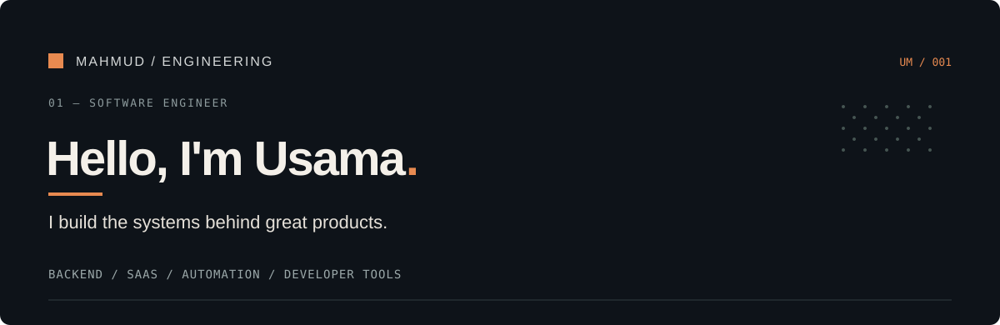

  

  Software engineer with <strong>6+ years</strong> building production SaaS applications, backend systems, and infrastructure-aware developer tooling.

  
  
  
  
  
  

### 01 / Engineering

`SaaS platforms` · `Backend architecture` · `Cloud integrations` · `Automation`

### 02 / Exploring

`AI engineering` · `Developer tools` · `Local AI` · `Distributed systems`

---

BUILD / EXPLORE / IMPROVE

  
  

